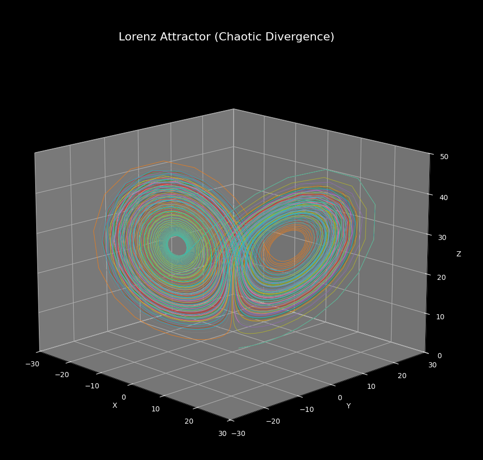

# Lorenz Attractor

Python program displaying the Lorenz Attractor by solving ODEs. 10 points are placed with a very small deviation and showcases chaotic divergence.

  <h3> Lorenz Attractor </h3>
  
  

